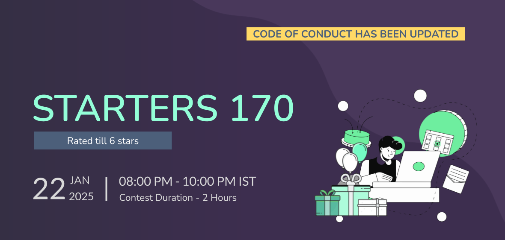
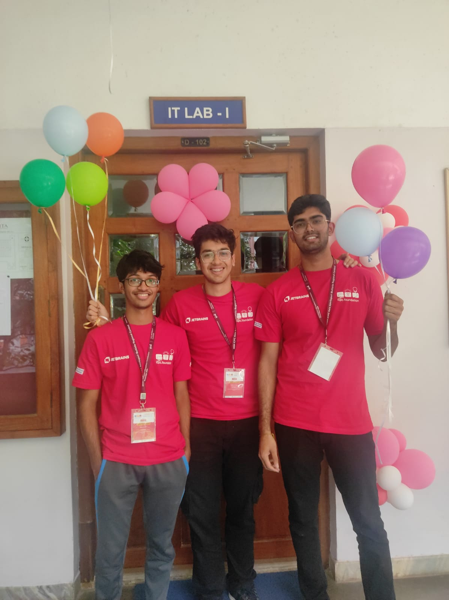
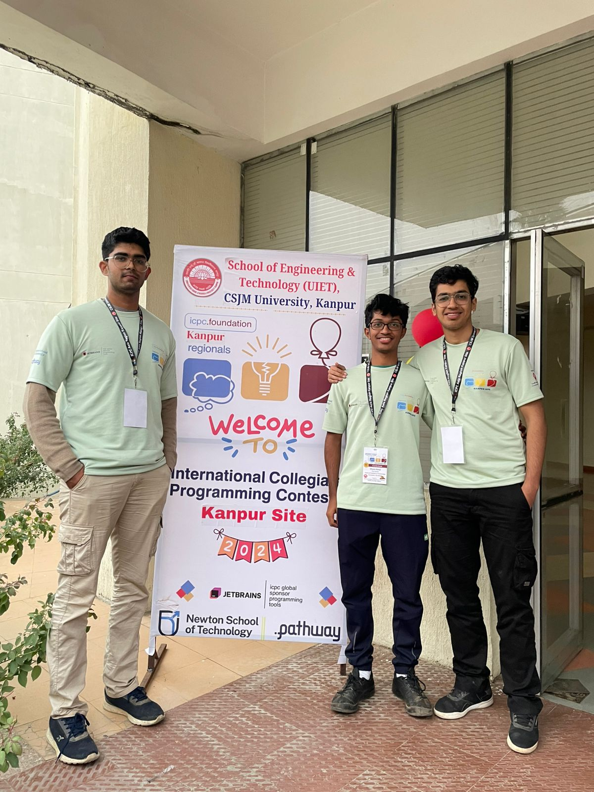

# WEC Algorithms SIG, NITK
# _A Milestone Achieved: WEC's First CodeChef Contest_

> Welcome to the Jan'25 edition of Bug Report! 
In this issue, we bring you updates on our members' achievements, a math problem and a competitive programming problem.

# WEC Algo Sets Questions for a Codechef Contest




We are thrilled to share a major milestone for our club—**for the first time ever**, we had the opportunity to **create all questions** for a **CodeChef contest**! This experience was both exciting and challenging, giving us a chance to contribute to one of the largest competitive programming platforms in the world.
If you've ever participated in a CodeChef contest, you’ve likely wondered:
How are these problems created?

Crafting problems for a competitive programming contest is no easy feat. It demands:
- Originality: Questions must be unique and not resemble existing ones.
- Freshness: Problems must feel new, engaging, and challenging for participants.
- Balanced Difficulty: The set should cater to varying levels of expertise.
Even when questions meet these criteria, they may still be rejected for reasons like resemblance to existing problems or being overly standard. 
> For example, one of our members had developed an excellent question, but unfortunately, it had to be set aside due to its similarity to an existing Chinese question, which did not even have an English translation.

After months of gruesome efforts, countless brainstorming sessions, and rigorous testing, we finally achieved our goal, creating an entire problem set for a CodeChef Contest. We're proud of our team's dedication and perseverance.

The following individuals created the questions that were accepted:
Setters: 
- Tarun Joshi
- Thrishank Reddy
- Prabhanjan Prabhu
- Sreyas Lakkimsetti
- Nilayan Mazumdar
- Suchit


We extend our heartfelt thanks to the following individuals for their invaluable contributions to the preparation and testing of the problems:
- Shyam Balaji
- Sanjay Bhat
- Madhav Dhingra
- Himaneesh Yadala
- Amruth Dinesh
- Vayun Jain

Check out the official codeforces blog for the same: [Codeforces blog]  
Check out the Codechef Invitation for the same: [Codechef Invitation]  
Check out the Contest here: [Codechef Contest]  
The Editorials with the solutions for our questions: [Editorial]


# ICPC Blogs: Trie Harder
**Author**: Shyam Balaji

Hello everyone,  
I am Shyam, the author of this blog, and here is our team's ICPC journey so far.  
Our team, **Trie Harder**, consists of:
- Shyam Balaji (me), 4th year
- Madhav Dhingra, 3rd year
- Tarun Joshi, 3rd year

<p>
    
    
</p>

This ICPC was my last chance (since I am in my 4th year) to qualify for regionals, something I had never done before. After choking last year's contest, I was determined to make sure I went to regionals once during my college years.

The first step in the ICPC journey is the Online Preliminary Round, which lasts for 2 and a half hours. We felt that this was probably the main obstacle for us, as the contest was quite short and somewhat luck-based. We also knew that we absolutely could not choke, as there were several strong teams from our college as well. To give some context, there are three onsite regional contests, and you can register for at most two of them. The qualification scenarios keep changing, but it is usually one team per college for the Kanpur and Chennai regionals, and one or two teams for Amritapuri per college.

Our preparation for the prelims consisted of giving a 5-hour team contest almost every week, as we had been doing individual preparation for quite some time. We knew that the most important thing was team chemistry. Team morale was quite strong going into the prelims, but it didn’t go as planned.

The first online preliminary was conducted on the DOM judge, and we took it together in my room.  
It didn’t go quite as planned. We got the cakewalk problem quite fast and moved on to the second problem, which I figured out the logic for quite quickly and started implementing. But it turns out my implementation was off, and after four wrong answers (WA), Tarun found the bug, and we got an accepted solution (AC). By now, we were 45 minutes into the contest with two ACs, which wasn’t great. So, we moved on to the third problem. This was also not too hard of a problem. A simple observation turned it into the standard coin change DP problem. Tarun got the idea for it, I implemented it, and we got AC. By then, the contest judge started showing issues; it took forever to open anything, and it was just plain annoying after having a bad start.

Finally, we were able to open the fourth problem. I thought it was a simple greedy solution, but it turned out to require a 4-state DP. Anyway, this was a pretty bad contest for us. We ended up around 150th and second in our college.

It turned out that everyone was facing issues with the contest platform, so they ended up conducting a re-contest, which was a blessing for us, giving us another chance to prove ourselves. The re-contest was scheduled a week later, and we were determined to do better. Once again, all of us sat in my room, ready. This time, the contest was hosted on CodeChef.

The contest started, and Tarun found the cakewalk problem and started implementing it, but got a WA. We found a small bug where we were printing the value instead of the index, fixed it, and got AC. We moved on to the second question, which had relatively low constraints, indicating it was likely a DP solution. We spent some time on this but weren’t getting anywhere. I ended up thinking of a strange greedy idea that I felt could work, so I implemented it, and luckily enough, it got AC. We moved on to the third problem, where all three of us struggled at first, but eventually converged on the correct construction. I implemented it, and we got AC. This problem took up most of our time, and the contest was pretty much over by then. We ended up getting around 90th rank and 1st in college. We were happy to come first in NITK but also disappointed that we could only manage 90th overall.

After this contest, there were the holidays. We didn’t practice as a team, but instead solved past ICPC regional problems and discussed them. Anyway, the Kanpur regional was approaching, and we had little expectation going into it, but it turned out to be the best contest performance we could have hoped for.

We arrived at Kanpur, and there was a practice round just to check if our systems were working. After that, there were a few talks and a grand dinner. We ate and slept quite early since the contest was scheduled to start at 10 in the morning the next day.

The next day, we arrived at the hall early at around 9:15, and they gave us access around 9:30. The contest was postponed for some unknown reason, but we were not complaining—it gave us ample time to write our templates. By "we", I mean Madhav, since one of the downsides of having high typing speed is that it forces you to be the template writer. Since we had so much time, we wrote everything we could think of: Segtree, Lazy Segtree, DSU, and LCA.

The contest finally started at around 11:30.

The format was a bit different here. A team was only given one laptop, so we had to optimize our PC usage. Also, we were not given the problem difficulty order, so we usually did the following: I read from the start, Madhav from the middle, and Tarun from the end.

The contest started, and we began reading the problems while keeping track of the scoreboard, trying to see which problems were solved first. This would point out which ones were easier. I noticed that problem B had been solved, and yes, it was a cakewalk problem. I coded it up and got AC. By that time, Madhav and Tarun had also solved problem K, and Madhav started coding the solution. Ten minutes later, he got an AC on it. We later realized that this was one of the harder problems in the set, with only about 10 people solving it in the end. This was also the hardest problem we solved, so it was an insane clutch by both of them.

We refreshed the scoreboard and saw that we should tackle problem I next. It looked like a straightforward constructive problem. Tarun and I quickly came up with an idea, and I started coding it up, but got a WA. Tarun found an extra case I had not handled, and we fixed it to get AC. The scoreboard showed that E and H were the next problems to solve. Madhav and Tarun were reading H, so I started reading E. I found a solution purely based on intuition and told Tarun. He thought it should work, but we had no proof. Still, with the AC count growing, I implemented it, and luckily it worked, so I got AC.

Our next focus was on problem E, and Madhav made decent progress on it. With it, I came up with a solution, coded it up, and got AC. The contest was going better than we had expected, with 5 ACs so far. Problems D and F looked like the next ones to solve, with both having similar numbers of solves. Tarun and I worked on D for a bit, found a good solution, coded it, and got AC. Meanwhile, Madhav got an idea for problem A and started coding it.

I read problem F and immediately found a solution for it. We swapped, and I started coding, but got a TLE. I found the bug, fixed it, and we got AC. We opened the scoreboard to find the next problem, but **we were all shocked to see that we were in 1st place**. Yes, somehow, we were in the lead. There were a couple of solves on problems A and G, so since Madhav was working on A, Tarun and I worked on G. We got an idea for it, and I started implementing. After two WAs, we fixed a few bugs and got AC. The segment tree template came in clutch here, as we didn’t waste any time coding that up.

It took quite a long time, though—around an hour. By the time we got AC on G, it was about 4 hours in, and we ended up slipping to 8th. We spent the last hour on problem A and were pretty close to the intended solution, but probably just had an implementation issue.

In the end, we finished 8th. Thankfully, the lower penalty allowed us to be the top team out of all the teams that solved 8 problems. We hope this is enough to qualify for the **Asia West regionals**, but regardless of whether we qualify or not, it was an insane experience where all of us performed at our best.


The rest of the day, we just chilled, reflecting on how we did and how fast the 5 hours went. My brain was fried, so I slept early, and the next morning, we left for Delhi, where we spent a couple of days. After that, we traveled to Coimbatore for the **Amritapuri Regional**, which was coming up in a few days.

Maybe we can talk about that another day…


# Spotlight questions

## Math Problem: The Four Liars
The problem of the four liars. It is known that each of four people, A, B, C, and D, tells the truth in only one case out of three. Suppose that A makes a statement, and then D says that C says that B says that A was telling the truth. What is the probability that A was actually telling the truth?

Remark. This problem can also be formulated in the following way. A slip of paper is given to A, who marks it with either a plus or a minus sign; the probability of his writing a plus is known to be 1/3. He then passes the slip to B, who may either leave it alone or change the sign before passing it on to C. Next C passes the slip to D after perhaps changing the sign; finally D passes it to an honest judge after perhaps changing the sign. The judge sees a plus sign on the slip. It is known that B, C, and D each change the sign with probability 2/3. What is the probability that A originally wrote a plus?

## Competitive programming problem:
### Problem Statement

There is an array A = [A₁, A₂, ..., Aₙ], and initially A[i] = i for all i. Define the following routine `shuffle(L, R)`:

- If R = L + 1, swap values of A[L] and A[R] and terminate.
- Otherwise, run `shuffle(L, R-1)` followed by `shuffle(L+1, R)`.

Suppose we run `shuffle(1, N)`. Print the value of A[K] after the routine finishes.

For each input file, solve T test cases.

#### Constraints

```
1 ≤ T ≤ 1000
2 ≤ N ≤ 10¹⁸
1 ≤ K ≤ N
```

#### Input Format

The input is given from Standard Input in the following format:

```
T
case 1
case 2
⋮
case T
```

Each case is in the following format:

```
N K
```

#### Output Format

```
Print T lines. The i-th line should contain the answer for the i-th case.
```

You can test your solutions on this site: [Atcoder Editor]

> Solutions for both problems will be provided in the next edition.


[Codechef Invitation]: <https://discuss.codechef.com/t/invitation-to-codechef-starters-170-rated-upto-6-stars-22nd-january/122323>
[Codeforces blog]: <https://codeforces.com/blog/shyamer3>
[Codechef Contest]: <https://www.codechef.com/START170>
[Editorial]: <https://discuss.codechef.com/tag/start170>
[Atcoder Editor]:<https://atcoder.jp/contests/agc061/submit?taskScreenName=agc061_a>
